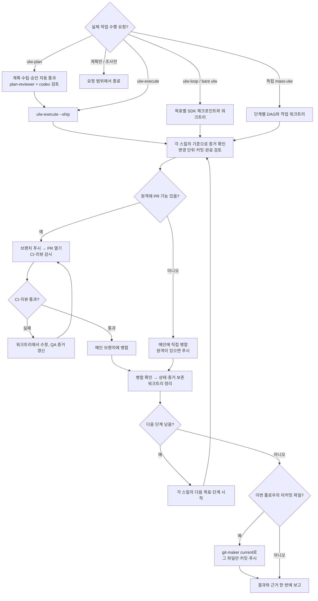

# 실행형 ULW 자동 완료 플로우

사용자가 `ulw-plan`, `ulw-execute`, `ulw-loop`(bare `ulw` 포함), 독립 실행 `mass-ulw` 등 **ULW 계열에서 실제 작업을 수행하라고 요청하면** 적용합니다. `ulw-plan`은 계획 작성 뒤 `ulw-execute --ship`으로 이어지고, 나머지는 각 스킬이 소유한 목표·상태·증거를 유지하면서 아래 공통 전달 단계를 수행합니다. 사용자에게 단계마다 허락을 다시 묻지 않습니다. 이 규칙은 `agent-behavior.md`의 커밋·푸시 예외에 해당하지만, 사용자가 명시한 "계획만", "실행하지 말고", "PR만 열어", "병합하지 말고", "커밋하지 말고", "푸시하지 말고" 같은 범위 제한이 우선합니다. 단순히 ULW 이름을 설명·인용·조사하는 요청에는 적용하지 않습니다.

## 단계별 규칙

**1. 진입점과 소유 상태**
- `ulw-plan`: 아래 계획 단계를 거쳐 `ulw-execute --ship`으로 넘깁니다. 명시적으로 계획만 요청했다면 계획과 그 검토에서 종료합니다.
- `ulw-execute`: 계획 선택·Boulder·체크박스·원장을 그대로 소유합니다. 직접 호출도 기본적으로 `--ship`과 같은 전달까지 진행하며, `--make-pr`만 명시했거나 병합을 금지했다면 PR에서 멈춥니다.
- `ulw-loop` / bare `ulw`: SDK가 목표·증거·체크포인트를 소유합니다. 목표별 워크트리에서 검증과 커밋을 마친 뒤 통합 기반에 안착시키고 다음 목표로 갑니다. 별도 Boulder나 계획 체크박스를 만들지 않습니다.
- 독립 `mass-ulw`: DAG는 각 단계의 의존 작업만 소유합니다. 실행 전 작업용 워크트리와 성공 기준을 정하고 단계별 검증·커밋·전달을 수행합니다. `ulw-loop`나 `ulw-execute` 안에서 호출됐다면 상위 흐름이 전달을 한 번만 소유하며 DAG 노드는 메인을 병합하거나 별도 전달하지 않습니다.

**2. 계획 (ulw-plan에서 시작했을 때만)**
- 스킬의 탐색·조사, 의도 판정(CLEAR/UNCLEAR), 초안(`.omo/drafts/<slug>.md`) 기록은 그대로 수행합니다. plan-reviewer 검토는 3단계에서 계획 파일을 대상으로 합니다.
- 스킬이 owner-decision으로 분류한 갈림길(되돌릴 수 없는 삭제, 비용, 데이터 스키마 등)은 `agent-behavior.md`의 "질문해도 되는 경우"에 해당할 때만 묻고, 나머지는 스킬의 기본값 채택 절차대로 정해 계획에 기록합니다.

**3. 승인 자동 통과 (ulw-plan에서 시작했을 때만)**
- "계획을 작성할까요?", "승인할까요?", approval brief 지점에서 묻지 않고 승인된 것으로 간주해 `.omo/plans/<slug>.md`를 작성합니다.
- 스킬의 "approval is not execution", "execution starts separately" 문구는 이 규칙으로 대체됩니다. "다음 세션에서 /ulw-execute를 실행하세요" 같은 안내를 하지 않습니다.
- 계획 파일 작성 뒤 plan-reviewer 검토를 받고, 이어서 `codex-chatgpt-web.md`의 "ulw 플로우 자동 검토 1)"을 돌립니다(사용량 안이면 항상, 최대 2회). plan-reviewer 호출이 하네스에서 거부되면 계획 파일을 직접 검토하고 그 사유를 보고에 남깁니다. FAIL이면 계획을 고쳐 재검토하고, 2회 뒤에도 남는 FAIL은 계획의 "알려진 위험"에 적은 뒤 실행으로 넘어갑니다.

**4. 실행 및 공통 전달**
- `ulw-plan`에서 시작했다면 검토가 끝난 같은 세션에서 `ulw-execute` 스킬을 읽고 `ulw-execute <계획이름> --ship`(스킬 호출 표기)으로 실행합니다. 계획 선택 질문도, "실행할까요?"도 하지 않습니다. 다른 진입점은 해당 스킬로 계속합니다.
- 모든 실행형 진입점에서 각 작업 단위의 테스트와 실제 동작 증거를 확인하고 저장소의 커밋 관례에 따라 그 단위만 커밋합니다. 스킬 고유의 검증 기준을 느슨하게 만들지 않습니다. 계획 파일이 없으면 계획 검토는 건너뛰되 작업 완료 검토는 목표·증거 원장을 기준으로 합니다.
- `--ship`과 같은 전달: 각 단계의 작업 브랜치를 푸시해 PR을 열고, CI·리뷰를 감시해 실패는 워크트리에서 고쳐 새 QA 증거를 남긴 뒤 재시도하며, 저장소 병합 정책(기본 squash 또는 저장소 설정)대로 **메인 브랜치에 병합될 때까지** 자리를 지킵니다. "병합할까요?"라고 묻지 않습니다. 명시적인 PR 전용·병합 금지 요청은 예외입니다.
- 원격이나 PR 기능이 없는 로컬 저장소면 워크트리 브랜치를 메인에 직접 병합하고, 푸시 가능한 원격이 있으면 푸시합니다.
- 실행 중 질문은 `agent-behavior.md` 4절 네 가지에 해당할 때만 합니다(스킬이 예로 드는 목표 누락·파괴적 작업·보안·제품 판단도 이 네 가지 안에서 판단).
- 해당 단계의 증거가 모두 `confirmed`가 되면 병합 전에 `codex-chatgpt-web.md`의 "ulw 플로우 자동 검토 2)"를 돌립니다(최대 2회). 2회 뒤에도 FAIL이 남으면 병합하지 않고 보고합니다.

**5. 워크트리 정리**
- 각 스킬이 이미 정리했다면 결과만 확인합니다. 남은 워크트리는 병합 확인 전에는 지우지 않습니다. 확인 기준은 PR이면 상태 merged, 직접 병합이면 병합 때 기록한 결과 커밋이 메인에 있는 것입니다. squash 병합에는 `git branch --merged`를 확인 기준으로 쓰지 않습니다.
- 정리가 필요하면 먼저 해당 흐름의 원장 위치(`.omo/ulw-execute/`, `.omo/ulw-loop/` 또는 독립 `mass-ulw`의 증거 경로)를 확인합니다. 워크트리에만 있는 이번 작업의 미추적·무시 증거는 메인 체크아웃으로 옮기고, 추적 파일의 미커밋 변경이나 소유자가 불분명한 파일은 보존합니다. 대상 워크트리의 `git status --porcelain --ignored`에 변경이나 미추적·무시 파일이 남으면 강제 삭제하지 말고 원장에 기록한 뒤 멈춰 보고합니다. 작업 브랜치에서 벗어나 대상 워크트리가 깨끗한 경우에만 `git worktree remove <경로>` → 병합이 확인된 브랜치에 한해 `git branch -D <작업브랜치>` → 원격에 남았으면 `git push origin --delete <작업브랜치>` 순서로 정리합니다. `<저장소>-wt/` 폴더가 비면 그 폴더도 지웁니다.
- 삭제한 경로와 브랜치를 원장에 한 줄로 남깁니다.

**6. 남은 변경 커밋 (git-maker current)**
- 정리 후에도 이번 플로우가 만든 미커밋 변경(`.omo/plans/`, `.omo/ulw-execute/`, `.omo/ulw-loop/` 등)이 남으면 `git-maker`를 `current` 범위로 실행해 그 파일만 커밋·푸시합니다. 원장과 워크트리 기록으로 파일을 확인하고, 사용자나 다른 에이전트가 미리 바꾼 변경은 절대 포함하지 않습니다. 남은 변경이 없으면 건너뜁니다.
- 스킬이 소유한 목표·체크박스가 남았거나 검증 verdict가 `confirmed`가 아니거나 PR이 병합되지 않았거나 워크트리가 남아 있으면 커밋하지 않고 어디서 멈췄는지 보고합니다.

## 멈추는 경우 (이때만)

- `agent-behavior.md`의 "질문해도 되는 경우" 네 가지 중 하나
- 실행 단계에서 같은 검사 항목이 같은 원인으로 두 번 실패(CI 잡, 리뷰 지적, 검증 verdict 모두 포함)
- 작업 완료 검토 2)가 2회 뒤에도 FAIL
- 병합 결과 커밋을 메인에서 확인할 수 없음
- `git worktree remove`가 미커밋 변경 때문에 거부됨
- 6단계 진입 시 목표·체크박스·PR·워크트리 중 하나라도 미완
- 사용자가 "계획만", "실행하지 말고", "커밋하지 말고"처럼 일부만 요청 (이 요청이 이 규칙보다 우선)

## 보고

끝나면 한 번에 보고합니다. 계획 파일 경로, 실행 결과와 검증 근거, PR 주소와 병합 결과, 삭제한 워크트리와 브랜치, 커밋 목록(`<sha> <subject>`)과 푸시 결과를 적습니다.
